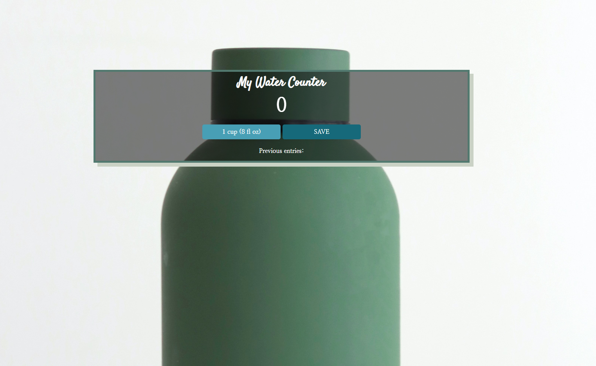

# watercounter
Staying hydrated! JavaScript counter practice

# Frontend Mentor - Clipboard landing page solution

This is a solution to the [Clipboard landing page challenge on Frontend Mentor](https://www.frontendmentor.io/challenges/clipboard-landing-page-5cc9bccd6c4c91111378ecb9).

## Table of contents

- [Overview](#overview)
  - [The challenge](#the-challenge)
  - [Screenshot](#screenshot)
  - [Links](#links)
- [My process](#my-process)
  - [Built with](#built-with)
  - [What I learned](#what-i-learned)
  - [Continued development](#continued-development)
  - [Useful resources](#useful-resources)

## Overview
  Designing a javascript counter

### The challenge

Users should be able to:

- Press the 1 cup button to track how many cups of water they had
- Press the save button to save their entries

### Screenshot

### Links

- Solution URL: https://github.com/Jud1th1/watercounter/
- Live Site URL: https://splendorous-water-counter.netlify.app/

## My process
- Followed along with Scrimba Tutorial 
  https://scrimba.com/learn/learnjavascript/deploy-with-netlify-cwGp4RcJ

### Built with

- Semantic HTML5 markup
- CSS custom properties
- JavaScript 

### What I learned

I learned how to set up a JavaScript file, write functions (that increment and sum), other JS essentials and how to use those to create this counter

### Continued development
- I plan practicing more JS, I would love to create a mediation app for example. As well as learn JS frameworks and libraries

### Useful resources

 - https://scrimba.com/learn/learnjavascript/deploy-with-netlify-cwGp4RcJ

